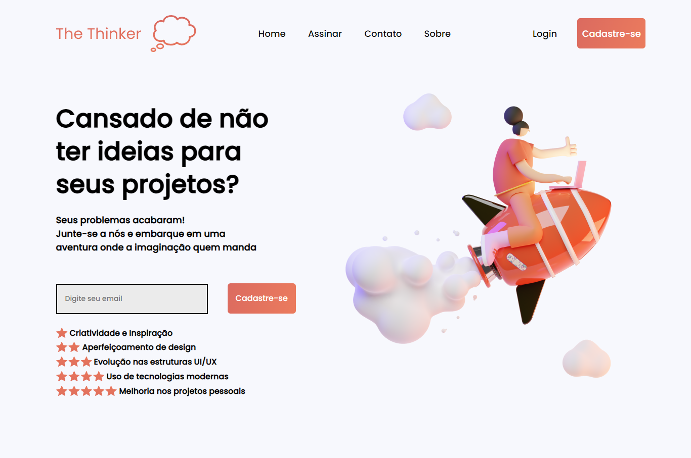
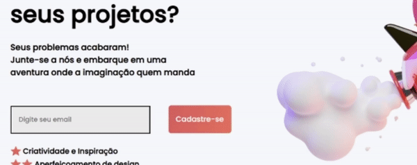

# Landing_UI
Landing Page feita considerando os recursos das tecnologias UI/UX e valorizando a interação com o usuário, seja por meio de animações ou um pop-up interativo na área de cadastro.

  
## Animações
As animações feitas a partir da folha de estilo, deixam uma plataforma muito mais interativa e interessante para o usuário. 

  
## Pop-up Interativo
Além das animações, os pop-ups também são uma ótima forma de se comunicar com o usuário, eles dão a confirmação do que este está fazendo na página.
  Essas interações foram feitas por meio da biblioteca <a href="https://sweetalert2.github.io">sweetalert2</a>.

